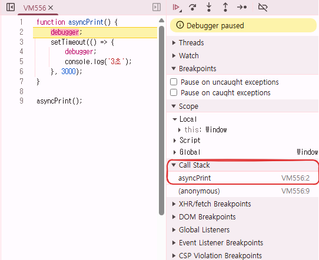
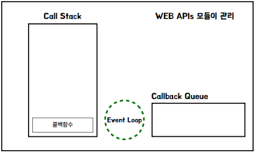
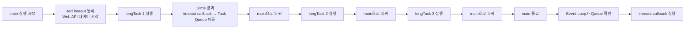

# 이벤트 루프와 콜백큐

## 1. 콜스택과 자바스크립트 디버깅

콜스택은 자바스크립트 엔진이 현재 실행 중인 함수들의 경로를 기록하는 메모리 구조입니다. 자바스크립트는 한 번에 하나의 작업만 수행할 수 있는 '싱글 스레드' 언어이기 때문에, 실행 순서를 엄격하게 관리하기 위해 이 구조를 사용한다.

- 핵심 원리: LIFO (Last In, First Out)
- Push (쌓기): 함수가 호출되면 스택의 맨 위에 추가된다.
- Pop (꺼내기): 함수의 실행이 완료되면 스택의 맨 위에서 제거된다.

```javascript
/**
 * Step 1 (초기 상태): 전역 실행 컨텍스트(Global Context)가 스택에 깔립니다.
 * Step 2 (a() 호출): 스택에 a가 쌓입니다. [Global, a]
 * Step 3 (b() 호출): a 내부에서 b가 호출되어 a 위에 쌓입니다. [Global, a, b]
 * Step 4 (c() 호출): b 내부에서 c가 호출되어 가장 위에 쌓입니다. [Global, a, b, c]
 * Step 5 (c() 종료): c가 실행을 마치면 스택에서 빠집니다. [Global, a, b]
 * Step 6 (순차적 종료): b가 끝나고, 마지막으로 a가 끝나며 스택이 비워집니다.
 **/
function c() {
  console.log("세 번째 함수(c) 실행 중");
}

function b() {
  c(); // a에 의해 호출된 b가 다시 c를 호출
}

function a() {
  b(); // a가 b를 호출
}

a(); // 전체 프로세스 시작
```

### 1-1. 비동기

```javascript
function asyncPrint() {
  debugger;
  setTimeout(() => {
    debugger;
    console.log("3초");
  }, 3000);
}

asyncPrint();
```

<div align="center">
    
</div>
<br/>

## 2. 이벤트루프와 단일쓰레드의 부정확성

### 2-1. 핵심 구성 요소

- `Call Stack (콜스택)`: 자바스크립트 엔진이 한 번에 하나씩 코드를 실행하는 곳입니다.
- `Web APIs`: 브라우저가 제공하는 모듈로, setTimeout, DOM, AJAX 등 시간이 걸리는 작업을 자바스크립트 엔진 대신 처리합니다.
- `Callback Queue (콜백 큐)`: Web API에서 작업이 완료된 함수들이 콜스택으로 가기 전 줄을 서서 기다리는 대기실입니다.
- `Event Loop (이벤트 루프)`: 콜스택이 비어있는지 수시로 확인하여, 비어있다면 큐에서 기다리는 함수를 콜스택으로 옮겨주는 감시자입니다.

<div align="center">
    
</div>
<br/>

### 2-2. 예시 상황

- **메인 코드 전체가 하나의 큰 실행 단위**
  - `예상 프로세스`: 첫 번쨰 longTask() 실행, 10ms가 지나면 setTimeout 콜백이 바로 실행 준비 완료, 첫 번째 longTask()가 끝난 직후, 두 번째 longTask() 전에 timeout 콜백이 먼저 실행될 것이다. ❌
  - `실제 프로세스`: longTask() 3개가 종료된 후에 setTimeout 내부 함수가 실행된다. ✅
    - setTimeout(), longTask() 3개는 연속된 동기 코드라서, 엔진은 중간에 멈추고 큐를 확인하지 않는다.
    - main 함수 실행 흐름 안에 longTask() 동기 코드가 모두 종료된 후 콜스택이 비었을 때 setTimeout() 내부 함수가 이벤트 루프에 의해서 콜스택에 들어가게 된다.
- `정리`: Main Thread가 바쁘면 옝정된 작업이 제때 동작하지 않는다. setTimeout은 부정확할 수 있다.

```javascript
function longTask() {
  console.log("2. 엄청 긴 작업 시작...");
  const start = Date.now();
  while (Date.now() - start < 1000) {
    // 3초 동안 루프를 돌며 스택을 점유함 (Blocking)
  }
  debugger;
  console.log("3. 엄청 긴 작업 끝!");
}

setTimeout(() => {
  debugger;
  console.log("나중에 실행될 비동기 작업");
}, 10);

longTask(); // 3초 소요
longTask(); // 3초 소요
longTask(); // 3초 소요
```



<br/>

## 3. 이벤트와 타이머제어 (예시)

### 3-1. 동기 타이머 예시

- **1단계: 초기 실행(메인 스크립트)**
  - `console.log("작업 시작")`: 콜스택에 들어와 즉시 실행되고 빠집니다. (출력: "작업 시작")
  - `첫 번째 setTimeout 호출`: 콜스택에 들어옵니다. 자바스크립트 엔진은 이 타이머를 Web API에 맡기고 즉시 콜스택에서 제거합니다.
  - `스크립트 종료`: 모든 동기 코드를 읽었으므로 전역 컨텍스트가 콜스택에서 빠집니다. 이제 콜스택은 완전히 비어 있는 상태가 됩니다.
- **2단계: 1초 후 (첫 번째 콜백 실행)**
  - Web API에서 1,000ms(1초)가 지나면, 첫 번째 콜백 함수가 **콜백 큐(Callback Queue)**에 들어갑니다.
  - 이벤트 루프의 확인: 콜스택이 비어있는 것을 확인하고, 큐에 대기 중인 첫 번째 콜백을 콜스택으로 올립니다.
  - `첫 번째 콜백 실행`: console.log("1초 후 첫 작업 완료")가 실행되고 빠집니다. (출력: "1초 후 첫 작업 완료")
  - `두 번째 setTimeout 호출`: 콜스택에 들어옵니다. 엔진은 다시 1,000ms 타이머를 Web API에 등록하고 스택에서 제거합니다.
  - `첫 번째 콜백 종료`: 실행을 마치고 콜스택에서 완전히 빠집니다. 다시 스택은 비워집니다.
- **3단계: 다시 1초 후 (두 번째 콜백 실행)**
  - 이제 Web API에서 두 번째 타이머가 작동하기 시작한 시점부터 1초가 흐릅니다.
  - `타이머 완료`: Web API는 두 번째 콜백 함수를 콜백 큐로 보냅니다.
  - `이벤트 루프의 확인`: 다시 한번 콜스택이 비었는지 확인한 후, 큐에 있던 두 번째 콜백을 스택으로 올립니다.
  - `두 번째 콜백 실행`: \* console.log("그 후 1초 뒤 두 번째 작업 완료")가 실행되고 빠집니다. (출력: "그 후 1초 뒤 두 번째 작업 완료")
  - `최종 종료`: 두 번째 콜백까지 종료되면서 모든 작업이 마무리됩니다.

```javascript
console.log("작업 시작");

setTimeout(() => {
  console.log("1초 후 첫 작업 완료");

  setTimeout(() => {
    console.log("그 후 1초 뒤 두 번째 작업 완료");
  }, 1000);
}, 1000);
```

<br/>

### 3-2. 다중 타이머 예시

- '바로 실행' -> '0초 뒤' -> '1초 뒤'

```javascript
setTimeout(() => console.log("1초 뒤"), 1000);
setTimeout(() => console.log("0초 뒤"), 0);
console.log("바로 실행");
```

<br/>

### 3-3. 이벤트와 정기적 실행

- 기능: 버튼을 누르면 1초마다 시간이 출력되고, 다시 누르면 멈춰야 한다.
- 관련 함수: addEventListener, setInterval, clearInterval

```html
<button id="toggleBtn">Toggle 버튼</button>
<div id="log"></div>

<script>
  const toggleBtn = document.querySelector("#toggleBtn");
  const log = document.querySelector("#log");

  let intervalID = null;
  toggleBtn.addEventListener("click", () => {
    if (intervalID) {
      clearInterval(intervalID);
      intervalID = null;
    } else {
      intervalID = setInterval(() => {
        const currentTime = new Date().toLocaleTimeString();
        log.textContent = currentTime;
      }, 1000);
    }
  });
</script>
```
