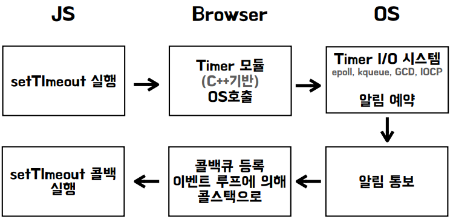

# 비동기 흐름제어 - 타이머와 콜백

## 1. 타이머 제어하기

<div align="center">
    
</div>
<br/>

### 1-1. 3초뒤 실행

- 3초 동안은 '진행중'을 출력하고, 3초 이후에는 '완료'를 출력

```javascript
function doHeavyWork() {
  console.log("로딩 중...");
  setTimeout(() => {
    console.log("오래걸리는 일 완료");
    console.log("완료 후속 처리 시작");
  }, 3000);
}

doHeavyWork();
```

### 1-2. 타임아웃 취소

- 3초이내 취소를 누르면 함수 취소

```javascript
let timeoutId;

function startTimer() {
  timeoutId = setTimeout(() => {
    console.log("3초 경과: 실행되었습니다.");
  }, 3000);

  console.log("3초 안에 눌러야 취소됨.");
}
startTimer();

function stopTimer() {
  clearTimerout(timerId);
  console.log("타이머가 취소되었습니다.");
}
setTimeout(stopTimer, 2000);
```

<br/>

## 2. 콜백지옥과 함수분리

- **중첩된 비동기**

```javascript
console.log("1초후 실행 시작");

setTimeout(() => {
  console.log("1초 지연");

  setTimeout(() => {
    console.log("2초 지연");

    setTimeout(() => {
      console.log("3초 지연");
    }, 3000);
  }, 2000);
}, 1000);
```

- **콜백함수 분리**

```javascript
console.log("1초후 실행 시작");

function step3() {
  console.log("3초 지연");
}

function step2() {
  console.log("2초 지연");
  setTimeout(step3, 3000);
}

function setp1() {
  console.log("1초 지연");
  setTimeout(step2, 2000);
}

setTimeout(step1, 1000);
```

- **콜백함수 분리 리팩토링**

```javascript
console.log("1초후 실행 시작");

function delay(cb, ms) {
  console.log(`${ms - 1000}ms 후 실행`);
  setTimeout(cb, ms);
}

const step3 = () => console.log("3초 지연");
const step2 = () => delay(step3, 3000);
const step1 = () => delay(step2, 2000);

setTimeout(step1, 1000);
```
