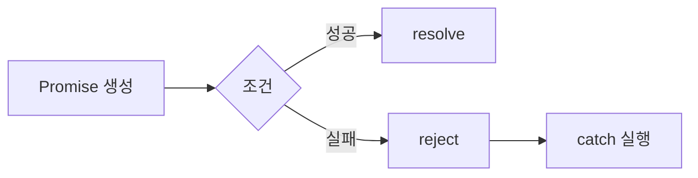

# Promise 패턴

## 1. Promise 패턴 소개

`콜백(Callback)` 방식은 비동기 처리를 하는 가장 기본적인 방법이었지만, 비동기 작업이 많아질수록 코드가 깊어지는 `콜백 지옥(Callback Hell)`이라는 치명적인 단점이 있다.

이를 우아하게 해결하기 위해 등장한 것이 바로 `Promise(프로미스)` 패턴이다. Promise는 말 그대로 "지금은 없지만, 나중에 줄게"라는 '약속'을 담은 객체이다. 비동기 작업이 완료된 후의 결과값(성공 혹은 실패)을 나타내는 대리자 역할을 한다.

```javascript
// ❌ 콜백 분리 함수: 계속해서 콜백을 전달해야 한다.
function delay1Second(callback) {
  setTimeout(() => {
    callback("1초 경과");
  }, 1000);
}

delay1Second((message) => {
  console.log(message);
});

// ✅ Promise 패턴
function delay(ms) {
  return new Promise((resolve) => {
    setTimeout(() => {
      resolve(`Waited for ${ms}ms`);
    }, ms);
  });
}

const result = delay(1000).then((message) => {
  return `Done: ${message}`;
});
result.then((value) => console.log(value));
```

<br/>

## 2. Promise 라이프사이클

- Promise 생성 → pending
- resolve/reject → 상태 결정 (동기적으로)
- then/catch/finally → microtask queue 등록
- call stack 비면 microtask 실행
- then 체이닝으로 계속 흐름 이어짐

```mermaid
flowchart LR
    A[Promise 생성<br/>pending] --> B[비동기 작업 수행]
    B --> C{결과}
    C -->|성공| D[resolve 호출<br/>fulfilled]
    C -->|실패| E[reject 호출<br/>rejected]

    D --> F[then() 등록된 콜백 실행]
    E --> G[catch() 등록된 콜백 실행]

    F --> H[다음 then으로 전달]
    G --> H
```

<br/>

## 3. Promise 동작 매커니즘

- 1️⃣ delay(1000) 호출
  - Promise 생성됨 (상태: pending)
  - executor 실행됨 (동기!)
- 2️⃣ then 체이닝 등록
  - 아직 resolve 안 됐기 때문에 실행 ❌
  - Promise 내부에 "대기" 상태로 등록됨
- 3️⃣ 1초 후 setTimeout 콜백 → Task Queue 진입
- 4️⃣ 이벤트 루프 실행
  - Promise 상태 → fulfilled
  - then 콜백 실행 예약 (microtask queue)
- 5️⃣ Microtask 실행 (then 1)
  - "✅ Done: Waited for 1000ms"
  - 이 값이 다음 then으로 전달됨
- 6️⃣ Microtask 실행 (then 2)
  - ✅ Done: Waited for 1000ms

```javascript
function delay(ms) {
  return new Promise((resolve) => {
    setTimeout(() => {
      resolve(`Waited for ${ms}ms`);
    }, ms);
  });
}

delay(1000)
  .then((message) => {
    return `✅ Done: ${message}`;
  })
  .then((finalMessage) => {
    console.log(finalMessage);
  });
```



<br/>

```mermaid
flowchart LR
    A[delay 호출] --> B[Promise 생성 pending]
    B --> C[setTimeout 등록 1000ms]
    C --> D[1초 대기]

    D --> E[Timer 완료 → Task Queue]
    E --> F[Event Loop → 콜백 실행]

    F --> G[resolve 호출 → fulfilled]
    G --> H[then1 → microtask queue]
    H --> I[then1 실행]

    I --> J[값 반환]
    J --> K[then2 → microtask queue]
    K --> L[then2 실행 → console.log]
```

## 4. Promise 에러 핸들링

### 4-1. reject 기본 개념

- Promise 상태 → rejected
- `.catch()` 또는 `.then(..., errorHandler)`로 전달됨

```
resolve → 성공 (fulfilled)
reject → 실패 (rejected)
```

### 4-2. 기본 예시

- `resolve()` -> `then()`
- `reject()` -> `catch()`

```javascript
function task(success) {
  return new Promise((resolve, reject) => {
    if (success) {
      resolve("성공!");
    } else {
      reject("실패!");
    }
  });
}

task(false)
  .then((res) => {
    console.log("then:", res);
  })
  .catch((err) => {
    console.log("catch:", err);
  });
```



### 4-3. then에서 에러 발생

- then() 내부에서 에러 발생시 catch()로 이동한다.

```javascript
// 잡힘: 중간 에러!
Promise.resolve("시작")
  .then((res) => {
    throw new Error("중간 에러!");
  })
  .catch((err) => {
    console.log("잡힘:", err.message);
  });
```

### 4-4. 체이닝에서 reject 흐름

```javascript
// catch: 에러 발생!
Promise.resolve()
  .then(() => {
    return Promise.reject("에러 발생!");
  })
  .then(() => {
    console.log("여긴 실행 안됨");
  })
  .catch((err) => {
    console.log("catch:", err);
  });
```

### 4-5. onRejected

- then에서 2번째 매개변수로 에러 처리가 가능하다.

```javascript
task(false).then(
  (res) => console.log(res),
  (err) => console.log("에러 처리:", err),
);
```

- **에러 복구**
  - onRejected에서 정상 값을 반환하면, 다음 `then()` 함수가 동작한다.

```javascript
// 예시 1
// 에러 처리: 에러 발생!
// 다음 then: 복구 완료
Promise.reject("에러 발생!")
  .then(null, (err) => {
    console.log("에러 처리:", err);
    return "복구 완료"; // 👉 정상 값 반환
  })
  .then((res) => {
    console.log("다음 then:", res);
  });

// 예시 2
// 처리만 함
// 다음 then: undefined
Promise.reject("에러!")
  .then(null, (err) => {
    console.log("처리만 함");
  })
  .then((res) => {
    console.log("다음 then:", res);
  });
```

- **에러 던지기**
  - onRejected에서 에러를 던지면, `catch()` 함수가 동작한다.

```javascript
Promise.reject("에러 발생!")
  .then(null, (err) => {
    console.log("에러 처리:", err);
    throw new Error("다시 에러!"); // 에러 전파
  })
  .then((res) => {
    console.log("여긴 안옴");
  })
  .catch((err) => {
    console.log("catch:", err.message);
  });
```

<br/>

## 5. async 함수와 await

- async 함수는 자동으로 Promise로 감싸져 반환하게 된다.
- await 뒤에는 Promise 객체가 들어간다.

```javascript
function delay(ms) {
  return new Promise((resolve) => {
    setTimeout(() => {
      resolve(`Waited ${ms}ms`);
    }, ms);
  });
}

async function run() {
  const result = await delay(1000);
  console.log(result);
}

run();
```

- **await**
  - await 뒤에 값은 자동으로 Promise 객체로 감싸진다.

```javascript
await 123; // await Promise.resolve(123)
await "hello"; // await Promise.resolve("hello")
await null; // await Promise.resolve(null)
```

### 5-1. async 함수로 then 변경하기

```javascript
// 기존 함수
function delay(ms) {
  return new Promise((resolve) => {
    setTimeout(() => {
      resolve(`Waited for ${ms}ms`);
    }, ms);
  });
}

delay(1000)
  .then((message) => {
    return `✅ Done: ${message}`;
  })
  .then((finalMessage) => {
    console.log(finalMessage);
  });

// 변환된 함수
async function delay(ms) {
  return new Promise((resolve) => {
    setTimeout(() => {
      resolve(`Waited for ${ms}ms`);
    }, ms);
  });
}

async function process() {
  const finalMessage = await delay(1000);
  console.log(finalMessage);
}
process();
```

<br/>

## 6. 데이터통신과 Promise then 메서드

### 6-1. 기존 XMLHttpRequest 방식

- 콜백 중복이 생긴다.

```javascript
const xhr = new XMLHttpRequest();

xhr.open("GET", "https://jsonplaceholder.typicode.com/todos/1", true);
xhr.onreadystatechange = function () {
  if (xhr.readyState === 4 && xhr.status === 200) {
    const res = JSON.parse(xhr.responseText);
    console.log("응답: ", res);
  }
};

xhr.send(); // send() 호출시 API 호출
```

<br/>

### 6-2. fetch API + Promise

- fetch() 결과는 Promise
  - body (ReadableStream)
  - headers
  - ok (boolean)
  - status (int)
  - statusText (string)
  - url (string)

```javascript
fetch("https://jsonplaceholder.typicode.com/todos/1")
  .then((res) => {
    // body 값을 읽고, JSON.parse() 한 값으로 반환
    return res.json();
  })
  .then((data) => {
    console.log("응답: ", data);
  })
  .catch((error) => {
    console.error("오류 발생: ", error);
  });
```

### 6-3. fetch API + async/await

```javascript
async function fetchData(url) {
  const res = await fetch(url);
  const data = await res.json();
  console.log("응답: ", data);
}

fetchData("https://jsonplaceholder.typicode.com/todos/1");
```
