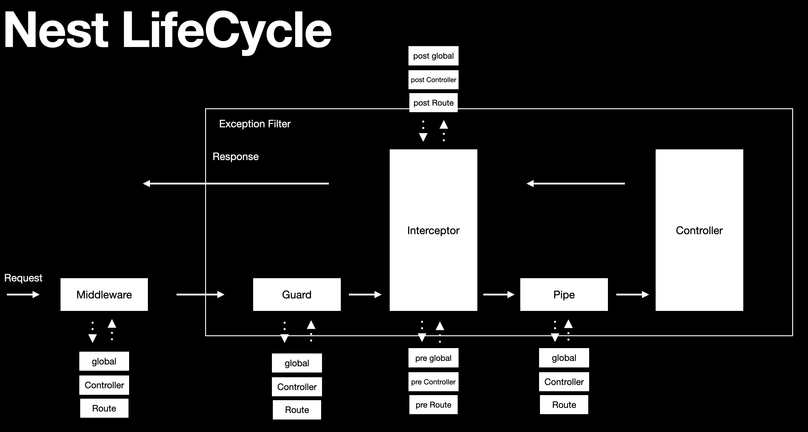

# NestJS 핵심개념

## 1. NestJS 라이프사이클

```
Client Request > Middleware > Guard > Interceptor > Pipe > 
요청 로직 처리(Controller, Service, Repository) > Exception Filter > Interceptor > Response
```

<div align="center">
    
</div>
<br/>

### Middleware

 - 전체 route에 적용
 - 특정 route에 적용
 - main.ts에서 함수 형식으로 전체 적용
```typescript

```

### Guard

 - 주로 인증 처리를 위해 사용
 - 전역으로 적용
 - 컨트롤러에 적용
 - route에 적용
```typescript
// 1. 커스텀 Guard 정의
// custom.guard.ts
import {
  CanActivate,
  ExecutionContext,
  Injectable,
  NotFoundException,
} from '@nestjs/common';
import { Observable } from 'rxjs';

@Injectable()
export class CustomGuard implements CanActivate {
  canActivate(
    context: ExecutionContext,
  ): boolean | Promise<boolean> | Observable<boolean> {
    console.log('this is custom guard');
    return true;
  }
}

// 2. 전역으로 적용 (main.ts)
app.useGlobalGuards(new CustomGuard())

// 3. 컨트롤러에 적용
@Controller('notifications')
@UseGuards(CustomGuard) 
export class NotificationsController {

  // 4. 특정 route에 적용
  @Get(':id')
  @UseGuards(CustomGuard)
  findOne(@Param('id') id:string) {
    // ..
  }
}
```

### Interceptor

 - 컨트롤러 요청전, 요청후에 로직을 수행
 - pipe() 안에 메서드를 작성하여 컨트롤러 요청 후 Response를 제어할 수 있음
 - 전역, 컨트롤러, 라우트 레벨로 정의 가능
 - 요청 진입시 global > controller > route 레벨로 방문하고, 반대로 응답시에는 route > controller > global 순으로 방문
```typescript
// 1. 커스텀 Interceptor 정의
import {
  Injectable,
  NestInterceptor,
  ExecutionContext,
  CallHandler,
} from '@nestjs/common';
import { Observable } from 'rxjs';
import { tap } from 'rxjs/operators';

@Injectable()
export class CustomInterceptor implements NestInterceptor {
  intercept(context: ExecutionContext, next: CallHandler): Observable<any> {
    // pre-interceptors
    console.log('this is pre custom interceptor');

    return next
      .handle()
      .pipe(tap(() => {
        // post-interceptor
        console.log(`this is post custom route interceptor`)
      }));
  }
}

// 2. 전역으로 적용 (main.ts)
app.useGlobalInterceptors(new CustomInterceptor());

// 3. 컨트롤러에 적용
@Controller('notifications')
@UseInterceptors(CustomInterceptor) 
export class NotificationsController {

  // 4. 특정 route에 적용
  @Get(':id')
  @UseInterceptors(CustomInterceptor)
  findOne(@Param('id') id:string) {
    // ..
  }
}
```

### Pipe

 - 유효성 검사, 요청 파라미터 형변환 등 처리
 - 전역, 컨트롤러, 라우트 레벨로 정의 가능
```typescript
// 1. 커스텀 Pipe 정의 (custom.pipe.ts)
import { PipeTransform, Injectable, ArgumentMetadata } from '@nestjs/common';

@Injectable()
export class CustomPipe implements PipeTransform {
  transform(value: any, metadata: ArgumentMetadata) {
    console.log('this is custom pipe');
    return value;
  }
}

// 2. 전역으로 적용 (main.ts)
app.useGlobalPipes(new CustomPipe());

// 3. 컨트롤러에 적용
@Controller('notifications')
@UsePipes(CustomPipe) 
export class NotificationsController {
    
  // 4. 특정 route에 적용
  @Get(':id')
  @UsePipes(CustomPipe)
  findOne(@Param('id', ParseIntPipe) id:number) {
    // ..
  }
}
```

## 2. 컨트롤러

### Movie API

 - GET /movie - 영화 목록 조회
 - GET /movie/:id - 특정 영화 조회
 - POST /movie - 영화 생성
 - PATCH /movie/:id - 영화 수정
 - DELETE /movie/:id - 영화 삭제
```typescript
import {
  Body,
  Controller,
  Delete,
  Get,
  NotFoundException,
  Param,
  Patch,
  Post,
  Query,
} from '@nestjs/common';
import { AppService } from './app.service';

interface Movie {
  id: number;
  title: string;
}

@Controller('/movie')
export class AppController {
  private movies: Movie[] = [
    {
      id: 1,
      title: '해리포터',
    },
    {
      id: 2,
      title: '반지의 제왕',
    },
  ];
  private idCounter = 3;

  constructor(private readonly appService: AppService) {}

  @Get()
  getMovies(@Query('title') title: string) {
    if (!title) {
      return this.movies;
    }

    //return this.movies.filter((m) => m.title === title);
    return this.movies.filter((m) => m.title.startsWith(title));
  }

  @Get('/:id')
  getMovie(@Param('id') id: string) {
    const movie = this.movies.find((m) => m.id === +id);

    if (!movie) {
      //throw new Error('movie not found');
      throw new NotFoundException('movie not found');
    }

    return movie;
  }

  @Post()
  postMovie(@Body('title') title: string) {
    const movie: Movie = {
      id: this.idCounter,
      title: title,
    };

    this.movies.push(movie);

    return movie;
  }

  @Patch('/:id')
  patchMovie(@Param('id') id: string, @Body('title') title: string) {
    const movie = this.movies.find((m) => m.id === +id);

    if (!movie) {
      throw new NotFoundException('movie not found');
    }

    Object.assign(movie, { title });

    return movie;
  }

  @Delete('/:id')
  deleteMovie(@Param('id') id: string) {
    const movieIndex = this.movies.findIndex((m) => m.id === +id);

    if (movieIndex === -1) {
      throw new NotFoundException('movie not found');
    }

    this.movies.splice(movieIndex, 1);

    return id;
  }
}
```

## 3. 프로바이더 & 서비스

### Dependency Injection

NestJS에서의 DI(Dependency Injection, 의존성 주입)은 프레임워크의 핵심 기능 중 하나로, 모듈 기반 구조와 결합되어 효율적인 의존성 관리와 높은 테스트 용이성, 유지보수성 향상을 제공합니다.

```typescript
// 일반적인 방식
class Service {
  private db = new Database(); // 직접 생성 (결합도 ↑)
}

// DI 방식
class Service {
  constructor(private db: Database) {} // 외부에서 주입받음 (결합도 ↓)
}
```

### Dependency Injection 예제

 - `Service 정의`
```typescript
// hello.service.ts
import { Injectable } from '@nestjs/common';

@Injectable()
export class HelloService {
  sayHello(): string {
    return 'Hello from Service!';
  }
}
```

 - `Controller에서 주입`
```typescript
// hello.controller.ts
import { Controller, Get } from '@nestjs/common';
import { HelloService } from './hello.service';

@Controller('hello')
export class HelloController {
  constructor(private readonly helloService: HelloService) {}

  @Get()
  getHello(): string {
    return this.helloService.sayHello();
  }
}
```

 - `Module 등록`
```typescript
// hello.module.ts
import { Module } from '@nestjs/common';
import { HelloController } from './hello.controller';
import { HelloService } from './hello.service';

@Module({
  controllers: [HelloController],
  providers: [HelloService], // 여기 등록하면 DI 가능
})
export class HelloModule {}
```